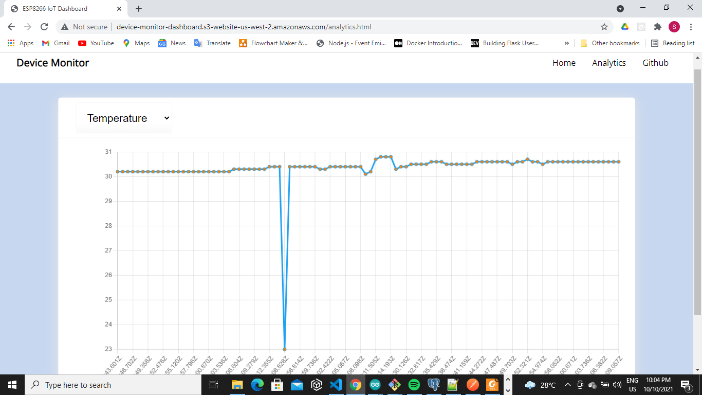

### Exploring AWS IoT 
AWS provides IoT services for building end-to-end IoT solutions that connect and manage billions of devices. It also provides easy integration with other AWS services for storage (i.e. DynamoDB), analytics (i.e. AWS IoT Analytics, AWS Data Pipeline), visualization (i.e. AWS Quicksight), Machine learning (i.e. AWS Sagemaker), streaming (i.e. AWS Kinesis), and serverless functions using AWS Lambda. Connected devices such as sensors, actuators, microcontrollers can connect to AWS IoT core via HTTPs,MQTT, and Websockets protocol. AWS IoT also provides SDKs for different languages and proper documentation to navigate each service. 

### Simple examples
- [Using Python SDK for communicating with AWS IoT core via MQTT publish/subscribe mechanism](https://github.com/rexsimiloluwah/learning-aws-iot/tree/master/python-aws-iot)
- [Using Node.js and JavaScript SDK for communicating with AWS IoT core, with IoT rules interfacing DynamoDB and SNS for mail notifications](https://github.com/rexsimiloluwah/learning-aws-iot/tree/master/nodejs-aws-iot)
- [Integrating Lambda functions with AWS IoT example](https://github.com/rexsimiloluwah/learning-aws-iot/tree/master/lambda-nodejs-example)
- [Visualization of data from AWS IoT Analytics pipeline using Python and Matplotlib](https://github.com/rexsimiloluwah/learning-aws-iot/tree/master/aws-iot-analytics.py)

### Demo Project
Building a simple serverless IoT system using NodeMCU (based on ESP8266 Wi-Fi SoC) and AWS IoT.

### Scope of the Project 
This project demonstrates how microcontrollers can be used to communicate with the AWS IoT core via MQTT to publish readings from multiple low-cost sensors, and control devices (i.e. light bulbs and other AC loads) in a stateful manner using device shadows. An interactive web dashboard was also developed using `HTML`,`CSS`, and `JavaScript` to demonstrate how the system can be integrated with web and mobile clients to deliver value to end-users. 

### Requirements 
#### Hardware Requirements 
- ESP8266-based NodeMCU board
- DHT11 (low-cost Temperature and Humidity sensor)
- LDR (Light dependent resistor)
- 1-channel relay module (for controlling AC loads)
- 5v power supply source 
- LEDs (for simple indication)
- Light bulb (or any alternative AC load) 
- 10k resistor (1)

#### Software Requirements 
- `Arduino IDE` (for programming and uploading code to the microcontroller). 
- Main IDE (i.e. VSCode)
- Arduino Libraries used:- 
  - `AdaFruit DHT library`
  - `ArduinoJSON` (for serialization and deserialization of JSON payloads, extremely useful and productive),
  - `ESP8266WiFi` (for connection to WiFi in station mode),
  - `PubSubClient` (for simple pub/sub messaging with the AWS IoT MQTT device message broker.)

#### Configuration steps 
- Create a `thing` in AWS IoT core 
- Attach a certificate, private key to the created thing. `NOTE:-` The client certificate and private key will be required by the MCU to connect to the AWS IoT device gateway for pub/sub over MQTT.
- Create a thing shadow 
- Create a cognito Identity pool. `NOTE:-` The Cognito identity pool will be required by the web client to connect via websockets over MQTT.
- Create IoT rules i.e. for inserting data into DynamoDB, ingesting data into an AWS IoT Data pipeline channel, for triggering SNS notifications etc. from your desired topic filters.

## Architecture Diagram 


## To program the NodeMCU 
1. Clone the repository to access the required files 
```bash
$ git clone https://github.com/rexsimiloluwah/learning-aws-iot
$ cd esp8266-aws-iot
```

2. Change the credentials in the `secrets.h` header file to your required credentials (AWS IoT endpoint, client certificate, private key, and root CA), `Kindly note that the credentials there are dummy credentials for security purposes`.

3. Connect the components following the circuit diagram (`Circuit diagram to be provided soon`)

4. Copy the code in [main.ino](https://github.com/rexsimiloluwah/learning-aws-iot/tree/master/esp8266-aws-iot/main.ino) file to your Arduino IDE, Upload the sketch to the microcontroller.

## To run the web dashboard 
1. Clone the repository to access the HTML,CSS, and JavaScript files: -
```bash
$ git clone https://github.com/rexsimiloluwah/learning-aws-iot
$ cd web-dashboard
```
2. Change the credentials in `config/aws-configuration.js` to your generated credentials for cognito identity pool ID and AWS IoT endpoint.

```javascript
let AWSConfiguration = {
   poolId: '<YOUR-COGNITO-IDENTITY-POOL-ID>',
   endpoint: '<YOUR-AWS-IOT-ENDPOINT>',
   region: '<YOUR-AWS-REGION>'
};
```

3. Run the `index.html` file and open in your browser 

### Screenshot of the web dashboard 


### Analytics 
Sensor data streams are ingested into an AWS IoT Analytics channel, transformed via a simple ETL-like workflow and stored in a DynamoDB table. A simple Lambda function is used to fetch that data in a paginated manner. The data is also displayed on the web dashboard in the analytics page 



### Video Demonstration
